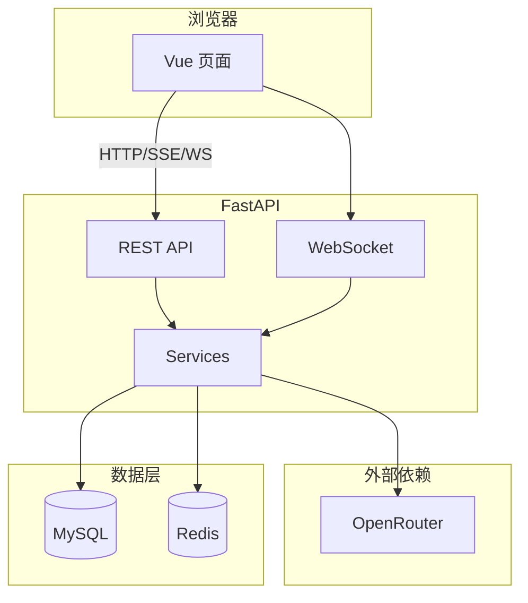

# AI 大模型评测平台 — 项目文档

> 文档版本：与代码库 `my_version` 同步（2026-05）  
> 项目路径：`my_version/`（前后端分离 Web 应用）

---

## 1. 项目概述

本平台用于**对比与评测大语言模型**在不同场景下的表现，支持：

- **交互式评测**：多模型并排（Side-by-Side）、单模型多 Prompt 变体（Prompt Lab）
- **语音评测（一期）**：音频上传/网页录制、音频输出播放与下载、语音评测工作台
- **模型库**：OpenRouter + AiHubMix 双平台同步，按输入/输出模态、价格、发布时间筛选
- **批量评测**：文本场景批量评测；**批量音频**（多音频 + 统一 prompt + ZIP 导出）
- **K-12 口语练习评测**：学生练习音频 → 教师模型（system + 仅音频）→ 自动听力/发音/内容评分
- **场景管理**：系统预设数据集 + 用户自定义 JSON 导入
- **统计与偏好**：Token/成本累计、用户维度用量、人工偏好评分

模型调用经 **Provider 抽象**（OpenRouter / AiHubMix），复合模型 ID 格式为 `platform:vendorModelId`（如 `openrouter:openai/gpt-audio`）。平台负责会话、落库、限流与进度推送。

---

## 2. 目录结构

```
my_version/
├── frontend/                 # Vue 3 前端
│   ├── src/
│   │   ├── api/              # 接口封装（user/model/conversation/rating/scenario/batch/stats）
│   │   ├── pages/            # 页面组件
│   │   ├── components/       # 全局头尾
│   │   ├── layouts/          # BasicLayout
│   │   ├── stores/           # Pinia（loginUser）
│   │   ├── utils/            # sseClient、wsClient
│   │   ├── router/           # 路由
│   │   ├── access.ts         # 路由守卫、拉取登录态
│   │   └── request.ts        # Axios 实例（withCredentials）
│   └── vite.config.ts        # 开发代理 /api → 后端
│
├── python-backend/           # FastAPI 后端
│   ├── app/
│   │   ├── api/              # HTTP / WebSocket 路由
│   │   ├── services/         # 业务逻辑
│   │   ├── models/           # SQLAlchemy ORM
│   │   ├── schemas/          # Pydantic 请求/响应
│   │   ├── core/             # 配置、错误码、OpenRouter、日志
│   │   ├── db/               # MySQL 会话、Redis
│   │   ├── middleware/       # Redis Session
│   │   └── utils/            # 限流、成本计算
│   ├── requirements.txt
│   └── .env                  # 本地配置（勿提交密钥）
│
└── sql/                      # 数据库脚本
    ├── create_table.sql      # 基础表（用户、对话、模型、评分）
    ├── batch_eval_tables.sql # 批量评测相关表
    ├── seed_scenarios.sql    # 系统预设场景
    ├── alter_model_platform.sql   # 模型 platform / releasedAt
    ├── migrate_model_ids_to_platform.sql  # id → openrouter:xxx
    ├── alter_audio_eval.sql       # 音频输入输出、批量音频字段
    └── alter_*.sql                # 其他增量迁移
```

**一期语音相关页面路由**

| 路径 | 说明 |
|------|------|
| `/models` | 模型库（双平台筛选） |
| `/voice-eval` | 语音评测工作台 |
| `/batch-audio` | 批量音频 / K-12 口语练习（两阶段：生成 + 评分）+ ZIP 导出 |

**K-12 口语练习流程**

1. **Step1 生成**：`jobType=oral_practice`，`userMessageMode=audio_only`，默认 K-12 教师 `systemPrompt`，输出 `text+audio`。
2. **Step2 评分**（任务完成后自动或 `POST /api/batch/job/{id}/score` 重跑）：
   - **听力**：`output_content` 与场景项 `expectedAnswer` 归一化匹配；
   - **发音**：HTTP `POST {PRONUNCIATION_EVAL_URL}/score`（`audio_base64` + `reference_text`，pcm16 自动转 WAV）；
   - **内容**：北极星三维（`gpt_eval_new_dimensions.py`）：语法准确表达、主题聚焦拓展、回复简洁清晰；Judge 模型见 `ORAL_EVAL_JUDGE_MODEL`（建议 `gpt-4o`）。
3. **结果**：`batch_job_result.evalScore` / `evalDetail`；结果页矩阵与「评分汇总」Tab；ZIP `metadata.json` 含分数。

**批量文本评分（仅 Step2）**：批量页选「批量文本评分」，导入 JSON/CSV（含 `modelOutput` 待评文本），`jobType=score_only`，不调被测大模型，直接听力/内容 Judge。迁移：`sql/alter_scenario_model_output.sql`。

迁移：`sql/alter_oral_eval_job.sql`；示例场景：`sql/seed_oral_practice_scenario.sql`。

**新增 API（节选）**

- `POST /api/model/sync?platform=openrouter\|aihubmix\|all`
- `GET /api/model/list` — 支持 `platform`、`inputModality`、`outputModality` 等筛选
- `POST /api/voice/eval/stream` — 语音评测 SSE（支持 `teacherMode` + `systemPrompt`）
- `POST /api/voice/eval/score` — 单条口语评分（调试 Judge）
- `POST /api/batch/job/create` — 扩展 `jobType` / `systemPrompt` / `evalConfig`
- `POST /api/batch/job/{id}/score` — 手动触发或重跑评分
- `GET /api/batch/job/{id}/export` — 批量结果 ZIP（含 eval 分数与 pcm→wav）

---

## 3. 技术栈

| 层级 | 技术 |
|------|------|
| 前端 | Vue 3、TypeScript、Vite 8、Ant Design Vue 4、Pinia、Vue Router 5、Axios、marked + DOMPurify |
| 后端 | Python 3、FastAPI、SQLAlchemy 2（async）、Pydantic v2 |
| 数据 | MySQL 8、Redis（Session + 限流 + 批量进度 Pub/Sub） |
| 模型 | OpenRouter + AiHubMix（`app/providers/`，OpenAI SDK 兼容） |
| 通信 | REST JSON + SSE（对话流式）+ WebSocket（批量进度） |

---

## 4. 系统架构



**鉴权**：Cookie `session_id` + Redis 存储登录态（`user_login_state`），与 Axios `withCredentials: true` 配合。

**统一响应**：`{ code, data, message }`，`code === 0` 成功；未登录 `40100`。

---

## 5. 功能模块

### 5.1 用户与权限

| 功能 | 说明 |
|------|------|
| 注册 / 登录 / 登出 | 密码 MD5 存储，Session 写 Redis |
| 管理员 | `userRole === admin`，可访问用户管理、同步模型列表 |

**页面**：`/user/login`、`/user/register`、`/admin/userManage`

### 5.2 模型管理

- 管理员从 OpenRouter 同步模型元数据至 `model` 表（价格、模态、上下文长度等）
- 所有登录用户可读模型列表，供对比页、批量页下拉选择

**API**：`POST /api/model/sync`（admin）、`GET /api/model/list`

### 5.3 Side-by-Side（模型对比）

- 同一 Prompt，并行调用 **1～8 个模型**
- **SSE 流式**返回，支持思考链（reasoning）、多模态（图/音/文件）、可选联网插件
- 落库 `conversation`（type=`side_by_side`）+ `conversation_message`
- 完成后可对一轮回复做**人工偏好**评分（model_better / tie / both_bad）

**页面**：`/side-by-side`  
**API**：`POST /api/conversation/side-by-side/stream`

### 5.4 Prompt Lab（提示词实验室）

- **同一模型**，2～5 个 Prompt 变体并行对比
- 支持 **AI 自动生成变体**：`POST /api/conversation/generate-variants`
- 流式 SSE，`variantIndex` 区分各变体列

**页面**：`/prompt-lab`  
**API**：`POST /api/conversation/prompt-lab/stream`、`POST /api/conversation/generate-variants`

### 5.5 场景管理（批量评测数据集）

| 类型 | 说明 |
|------|------|
| `system` | 系统预设，`userId` 为空，只读（4 类：通用问答、代码、推理、安全拒答） |
| `custom` | 用户自建，可编辑、导入、删除用例 |

**导入格式**（JSON 数组，最多 500 条）：

```json
[
  {
    "prompt": "问题内容",
    "expectedAnswer": "期望答案（供人工对照，MVP 不自动打分）",
    "category": "可选分类"
  }
]
```

**页面**：`/scenario`  
**API**：`/api/scenario/*`

### 5.6 批量评测

1. 用户选择场景 + 多个模型 + 并发数（默认 3）
2. 创建 `batch_job`，`totalTasks = 用例数 × 模型数`
3. 后台 `asyncio` 并发调用 OpenRouter（非流式）
4. 每条结果写入 `batch_job_result`，成功则累加统计
5. 经 **Redis Pub/Sub** 推送进度，前端 **WebSocket** 订阅

**页面**：`/batch`（创建与进度）、`/batch/jobs/:id`（对比矩阵 + 统计 Tab）  
**API**：`/api/batch/job/*`  
**WebSocket**：`/api/ws/batch/{jobId}`

**任务状态**：`pending` → `running` → `completed` | `failed` | `cancelled`

### 5.7 统计分析

| 接口 | 数据含义 |
|------|----------|
| `GET /api/stats/model` | 全平台：读 `model.totalTokens`、`totalCost`、`batchCallCount` |
| `GET /api/stats/user/me` | 当前用户：读 `user_model_stat`（按模型累计） |
| `GET /api/stats/user/me/summary` | 当前用户汇总 |

**「全平台模型」总 Token 来源**：`model.totalTokens` 为**累计字段**，在以下时机每次加上 `inputTokens + outputTokens`：

- Side-by-Side / Prompt Lab 每次 assistant 消息保存完成
- 批量评测每个**成功**子任务完成

Token 优先取 OpenRouter `usage`；缺失时用 `字符数/4` 估算（`CostCalculator.estimate_tokens`）。

### 5.8 其他

- **Chat 测试页**（`/chat`）：走 `/api/test/ai/stream`，用于简单联调，非主业务链路
- **主页**（`/`）：占位页

---

## 6. 数据库设计

### 6.1 核心表（`create_table.sql`）

| 表 | 用途 |
|----|------|
| `user` | 用户账号、角色 |
| `conversation` | 对话会话（类型、参与模型、总 token/成本） |
| `conversation_message` | 单条消息（含 token、成本、reasoning） |
| `model` | OpenRouter 模型元数据 + **全平台累计** token/成本/batchCallCount |
| `rating` | 用户对某轮对话的偏好评分 |

### 6.2 批量评测表（`batch_eval_tables.sql`）

| 表 | 用途 |
|----|------|
| `scenario` | 场景元信息 |
| `scenario_item` | 单条用例（prompt + expectedAnswer） |
| `batch_job` | 批量任务与进度 |
| `batch_job_result` | 用例 × 模型 的执行结果 |
| `user_model_stat` | 用户 × 模型 维度累计（调用次数、token、成本） |

### 6.3 初始化顺序

```bash
mysql -u<user> -p<db> ai_eval < sql/create_table.sql
mysql -u<user> -p<db> ai_eval < sql/batch_eval_tables.sql
mysql -u<user> -p<db> ai_eval < sql/seed_scenarios.sql
mysql -u<user> -p<db> ai_eval < sql/alter_model_batch_call_count.sql
# 按需执行 alter_model_add_modalities.sql、alter_model_expand_price.sql
```

---

## 7. API 一览

完整交互式文档：启动后端后访问 **http://127.0.0.1:9090/api/docs**

| 前缀 | 模块 |
|------|------|
| `/api/health` | 健康检查 |
| `/api/user` | 注册、登录、登出、用户分页（admin） |
| `/api/model` | 列表、同步（admin） |
| `/api/conversation` | Side-by-Side / Prompt Lab 流式、生成变体 |
| `/api/rating` | 保存偏好评分 |
| `/api/scenario` | 场景 CRUD、导入、用例管理 |
| `/api/batch` | 批量任务创建、列表、结果、取消 |
| `/api/stats` | 模型 / 用户统计 |
| `/api/ws/batch/{jobId}` | 批量进度 WebSocket |
| `/api/test` | 简单对话测试（非流式/流式） |

**限流（Redis 固定窗口）**：

- 对话流式：用户 5 次/分钟
- 生成变体：10 次/分钟
- 创建批量任务：5 次/10 分钟

---

## 8. 前端路由与页面

| 路径 | 页面 | 需登录 |
|------|------|--------|
| `/` | 主页 | 否 |
| `/user/login`、`/register` | 登录注册 | 否 |
| `/side-by-side` | 模型对比 | 是 |
| `/prompt-lab` | Prompt Lab | 是 |
| `/scenario` | 场景管理 | 是 |
| `/batch` | 批量评测 | 是 |
| `/batch/jobs/:id` | 评测结果 | 是 |
| `/admin/userManage` | 用户管理 | admin |
| `/chat` | Chat 测试 | 否（接口未强制登录） |

**开发代理**（`vite.config.ts`）：`/api` → `http://127.0.0.1:9090`，`ws: true`（含 WebSocket）。

---

## 9. 配置与启动

### 9.1 环境要求

- **Node.js** ≥ 20.19（推荐 `nvm use 22`）
- **Python** 3.10+
- **MySQL** 8、**Redis**
- **OpenRouter API Key**

### 9.2 后端

```bash
cd python-backend
python -m venv venv && source venv/bin/activate
pip install -r requirements.txt
cp .env.example .env   # 编辑 DB、Redis、OPENROUTER_API_KEY、SECRET_KEY
uvicorn app.main:app --host 0.0.0.0 --port 9090 --reload
```

主要环境变量见 `python-backend/.env.example`：`APP_PORT`、`DB_*`、`REDIS_*`、`OPENROUTER_API_KEY`、`CORS_ORIGINS`。

### 9.3 前端

```bash
source ~/.nvm/nvm.sh && nvm use 22
cd frontend
npm install
npm run dev
# 浏览器 http://localhost:5173
```

### 9.4 生产构建

```bash
cd frontend && npm run build   # 产物 frontend/dist
# 后端可继续 uvicorn 或由 Nginx 反代静态资源 + /api
```

---

## 10. 关键实现说明

### 10.1 流式对话（SSE）

- 后端 `StreamingResponse`，`media_type: text/event-stream`
- 多路流 `asyncio` 队列合并（`_merge_streams`）
- 前端 `createPostSSE` 解析 `data: {...}\n\n` JSON 块

### 10.2 批量进度（WebSocket）

- Worker：`ProgressPublisher.publish` → Redis channel `batch:progress:{jobId}`
- WS：校验 Cookie Session + 任务归属 → 订阅 Redis → 转发 JSON
- 连接时先发 `snapshot`，终态 `completed`/`failed`/`cancelled` 后关闭

### 10.3 成本计算

- OpenRouter 价格为**每 token**；库内 `inputPrice`/`outputPrice` 存**每百万 token**（同步时 ×1e6）
- `CostCalculator.calculate_cost`：按百万 token 单价计算 USD

### 10.4 安全注意

- `.env` 含 API Key，勿提交版本库
- 密码为 MD5（历史实现），生产建议升级为 bcrypt 等
- 管理接口依赖 Session + `check_admin`

---

## 11. 已知限制与后续扩展

| 项 | 说明 |
|----|------|
| 自动评分 | MVP 未实现；`batch_job_result.score` 预留 |
| 批量任务持久化 | 使用进程内 `asyncio.create_task`，重启会丢进行中的任务 |
| 任务取消 | API 已支持标 `cancelled`，Runner 协作式检查 |
| CSV 导入 | 仅 JSON |
| 结果页样式 | 对比矩阵在深色背景下可读性可优化 |
| Chat 页 | 与主 conversation 链路未统一 |

**可扩展方向**：Celery/ARQ 任务队列、LLM-as-Judge 自动评分、对话历史列表、导出 CSV、bcrypt 密码、对象存储存附件。

---

## 12. 相关文件索引

| 主题 | 路径 |
|------|------|
| 应用入口 | `python-backend/app/main.py` |
| 对话核心 | `python-backend/app/services/conversation_service.py` |
| 批量执行 | `python-backend/app/services/batch_job_service.py` |
| 场景服务 | `python-backend/app/services/scenario_service.py` |
| OpenRouter | `python-backend/app/core/openrouter_config.py` |
| 前端 SSE | `frontend/src/utils/sseClient.ts` |
| 前端 WS | `frontend/src/utils/wsClient.ts` |
| 路由 | `frontend/src/router/index.ts` |

---

*本文档由项目代码梳理生成，随功能迭代请同步更新 SQL 脚本与本文件。*
